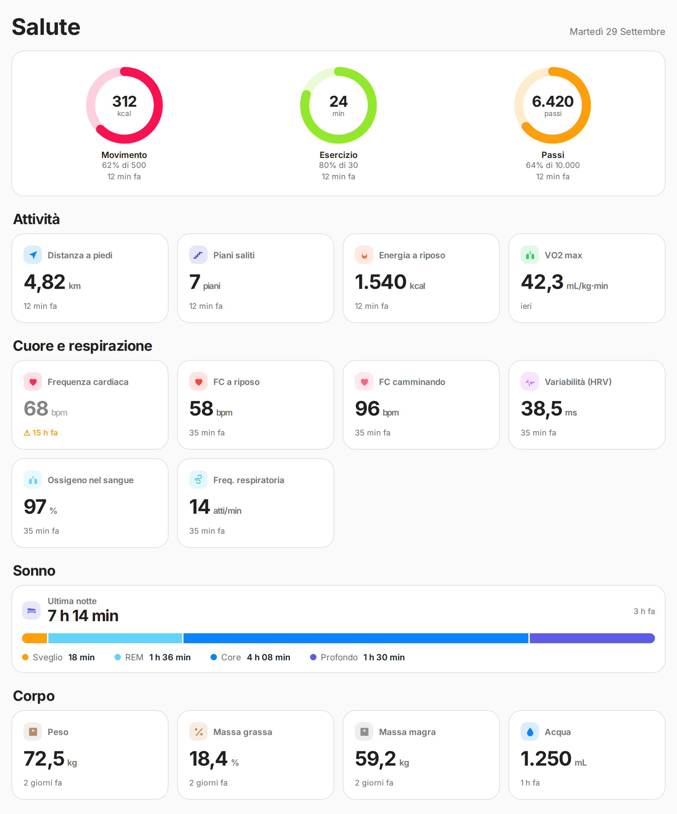
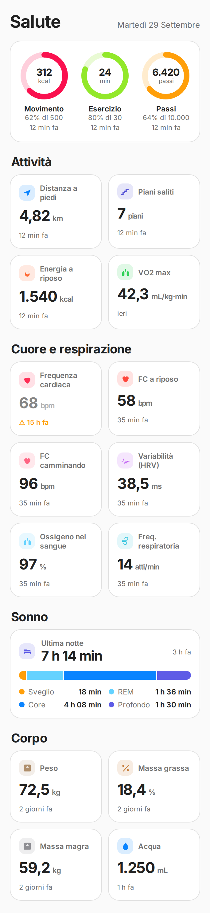
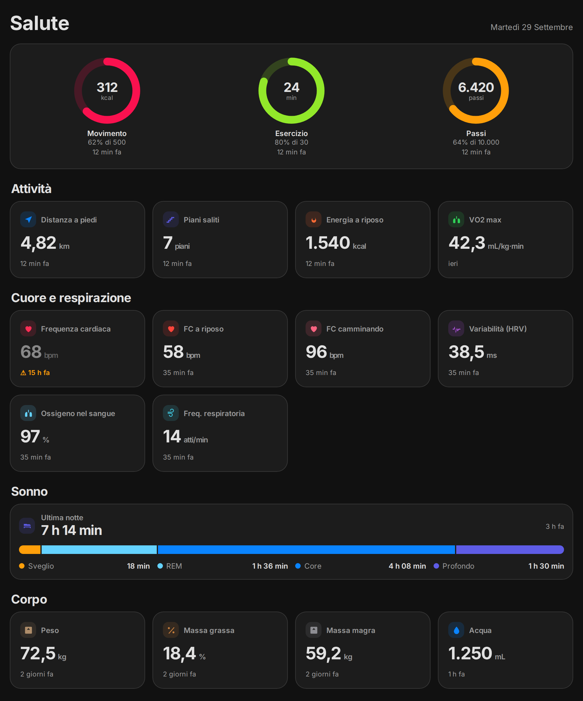

# Apple Health Card

A Home Assistant Lovelace card with an Apple Health–style layout, built for the health sensors that the **Home Assistant Companion app for iOS** creates from Apple Health.

[](https://hacs.xyz/docs/faq/custom_repositories)
[](https://github.com/riccardoq76/apple-health-card/actions/workflows/validate.yml)

<p align="center">
  
  
</p>

<details>
<summary>Dark theme</summary>
<p align="center"></p>
</details>

<sub>Screenshots use demo values, not real health data.</sub>

> The card speaks **English**, **Italian** and **Spanish** and follows the language of your Home Assistant (see [Language](#language)). Other translations are welcome as pull requests. The screenshots above show the Italian interface.

## What it shows

- **Activity rings**: Move (active energy), Exercise (exercise minutes), Steps, each with a configurable goal.
- **Activity**: walking + running distance, flights climbed, resting energy, VO2 max.
- **Heart and breathing**: heart rate, resting heart rate, walking heart rate average, HRV, blood oxygen, respiratory rate.
- **Sleep**: last night's total with a stage bar (awake, REM, core, deep).
- **Body**: weight, body fat, lean body mass, water.
- **Comparison with your 7-day average** (optional): under sleep, resting heart rate and HRV, a line like "−6 vs 7-day avg". See [7-day average](#7-day-average-optional).

Every tile shows **how old its value is** ("12 min ago", "yesterday"). Health data does not stream live: it reaches Home Assistant only when the iPhone syncs, so a "current" heart rate can be hours or days old. Values older than `stale_hours` are marked with ⚠ and dimmed. Body metrics (weight, body fat, lean mass, VO2 max) are never marked, since they change rarely. For these, the age is measured from the last time the *value changed*, not from the last time the app sent it: the Companion app can send the same weight again and again, which would otherwise look like a fresh measurement. (If Home Assistant restarts, the age restarts from the first update after the restart.)

Tiles whose sensor is missing or `unavailable` are hidden. Tapping a tile opens Home Assistant's standard history dialog.

## Requirements

- Home Assistant (tested on 2026.9 with a **sections** dashboard).
- Home Assistant **Companion app for iOS** with the Health sensors enabled (Companion app → Settings → Sensors). Tested with sensors named `sensor.<device>_heart_rate`, `sensor.<device>_health_steps`, `sensor.<device>_sleep_duration` and so on.
- The Android app uses Health Connect with **different sensor names**: it may work by mapping them with `entities:`, but it has not been tested.

## Installation

### HACS (custom repository)

1. HACS → three dots (top right) → **Custom repositories**.
2. Repository: `https://github.com/riccardoq76/apple-health-card`, type: **Dashboard**.
3. Find **Apple Health Card** in HACS and download it.
4. Reload the browser (Cmd/Ctrl + Shift + R). In the Companion app: Settings → Debug → Reset frontend cache.

### Manual

1. Copy `dist/apple-health-card.js` to `/config/www/apple-health-card.js`.
2. Settings → Dashboards → three dots → **Resources** → Add resource:
   URL `/local/apple-health-card.js?v=2.3.0`, type **JavaScript module**.
   Change the `?v=` number every time you replace the file, otherwise phones keep the cached copy.
3. Reload the browser.

## Configuration

Minimal:

```yaml
type: custom:apple-health-card
prefix: iphone
```

`prefix` is the part between `sensor.` and the metric name. If your sensors are called `sensor.my_iphone_heart_rate`, the prefix is `my_iphone`.

All options:

| Option | Default | Description |
|---|---|---|
| `prefix` | — | Companion app sensor prefix. Required unless every metric is set in `entities`. |
| `title` | `Health` / `Salute` | Card title. The default depends on the language. |
| `entities` | — | Map of metric → entity_id. Overrides the prefix for that metric. |
| `goals` | see below | Ring goals: `active_energy` (500 kcal), `exercise` (30 min), `steps` (10000). |
| `goals.sleep` | — | Optional sleep goal in hours (e.g. `7.5`). If set, last night's sleep shows a percentage of the goal. No default. |
| `stale_hours` | `12` | After how many hours a value is marked as old. |
| `hide_missing` | `true` | Hide tiles whose sensor is missing or unavailable. |
| `language` | `auto` | `auto` follows Home Assistant. Use `en`, `it` or `es` to force a language. |
| `averages` | — | Map of metric → 7-day average sensor. Supported metrics: `sleep`, `resting_heart_rate`, `hrv`. |
| `hide` | — | List of metrics to hide, e.g. `[water, lean_mass]`. Works for tiles, rings (`steps`, `exercise`, `active_energy`) and the sleep block (`sleep`). |
| `min_coverage` | `0.5` | Minimum share of the 7 days the average must cover (0 to 1). Below it, the difference is hidden. |

Full example:

```yaml
type: custom:apple-health-card
title: Salute
prefix: iphone
stale_hours: 24
goals:
  active_energy: 400
  exercise: 45
  steps: 8000
entities:
  weight: sensor.smart_scale_weight
```

### Metric keys and default sensors

| Key | Default entity (`sensor.<prefix>_…`) |
|---|---|
| `active_energy` | `active_energy` |
| `exercise` | `exercise_time` |
| `steps` | `health_steps` |
| `distance` | `walking_running_distance` |
| `flights` | `flights_climbed` |
| `resting_energy` | `resting_energy` |
| `vo2max` | `vo2_max` |
| `heart_rate` | `heart_rate` |
| `resting_heart_rate` | `resting_heart_rate` |
| `walking_heart_rate` | `walking_heart_rate_average` |
| `hrv` | `heart_rate_variability` |
| `spo2` | `blood_oxygen` |
| `respiratory_rate` | `respiratory_rate` |
| `weight` | `weight` |
| `body_fat` | `body_fat_percentage` |
| `lean_mass` | `lean_body_mass` |
| `water` | `water` |
| `sleep` | `sleep_duration` |
| `sleep_awake` | `awake` |
| `sleep_rem` | `rem_sleep` |
| `sleep_core` | `core_sleep` |
| `sleep_deep` | `deep_sleep` |

## Language

The card is available in English, Italian and Spanish.

- By default (`language: auto`) it uses the language Home Assistant is showing for the current user. If that language has no translation yet, the texts are in English.
- Numbers and dates follow the same language, even when the texts fall back to English.
- To force a language, set `language: en`, `language: it` or `language: es` (the visual editor has a selector too). Useful if your Home Assistant is in English but you want Italian, or the other way round.

To add a language: in `dist/apple-health-card.js`, copy the `en` block inside `I18N`, translate the texts, and open a pull request.

## 7-day average (optional)

The card can show how today's value compares with your recent average, for sleep, resting heart rate and HRV. It does not calculate the average itself: you create one **Statistics** helper per metric in Home Assistant, then point the card at it.

1. Settings → Devices & services → Helpers → **Create helper** → **Statistics**.
2. Source entity: for example `sensor.iphone_sleep_duration`. Statistic characteristic: **Arithmetic mean**. Maximum age: **7 days**. Sampling size: 100 (or more).
3. Repeat for `resting_heart_rate` and `heart_rate_variability`.
4. Add the new sensors to the card:

```yaml
type: custom:apple-health-card
prefix: iphone
averages:
  sleep: sensor.sleep_7_day_average
  resting_heart_rate: sensor.resting_hr_7_day_average
  hrv: sensor.hrv_7_day_average
```

Things to know:
- The difference is only a sign and a size ("+3", "−18 min"). The card does not say whether it is good or bad, and it is not medical advice.
- The average is calculated over the values Home Assistant recorded in the last 7 days, and it includes today's value. It is an approximation, not the figure Apple Health would show.
- A new helper reads the recorder history, so it starts with whatever the recorder still has. The card hides the difference while the average covers less than `min_coverage` of the 7 days (it reads the `age_coverage_ratio` attribute of the helper).
- If a metric is not in `averages`, nothing changes for that tile.

## Trend charts

The card shows current values only. For trends, see [`examples/dashboard.yaml`](examples/dashboard.yaml): a two-view dashboard (today + trends) that uses native statistics graphs and [apexcharts-card](https://github.com/RomRider/apexcharts-card). The trends view has sleep (total and stages), resting heart rate and HRV (daily average), steps, active energy, exercise minutes with a 30 min goal line, weight and VO2 max. Replace the `iphone` prefix in the sensor names with yours.

Why the sleep and heart charts do not use daily statistics: since data arrives only when the iPhone syncs, a daily statistic repeats the previous night on days without a sync, and mixes two nights on the day a new value arrives. The example uses raw history grouped by day instead, which is limited by the recorder retention (10 days by default; set `purge_keep_days` in the `recorder:` section of `configuration.yaml` to keep more, e.g. 60).

## Privacy

This card only reads states that the current Home Assistant user can already see. It makes no network requests and writes nothing.

Health data is sensitive. Consider putting the card on a dashboard restricted to administrators (dashboard settings → *Admin only*), not on a shared wall tablet, and check that the health sensors are not exposed to voice assistants or to the HomeKit bridge.

## License

[MIT](LICENSE)
